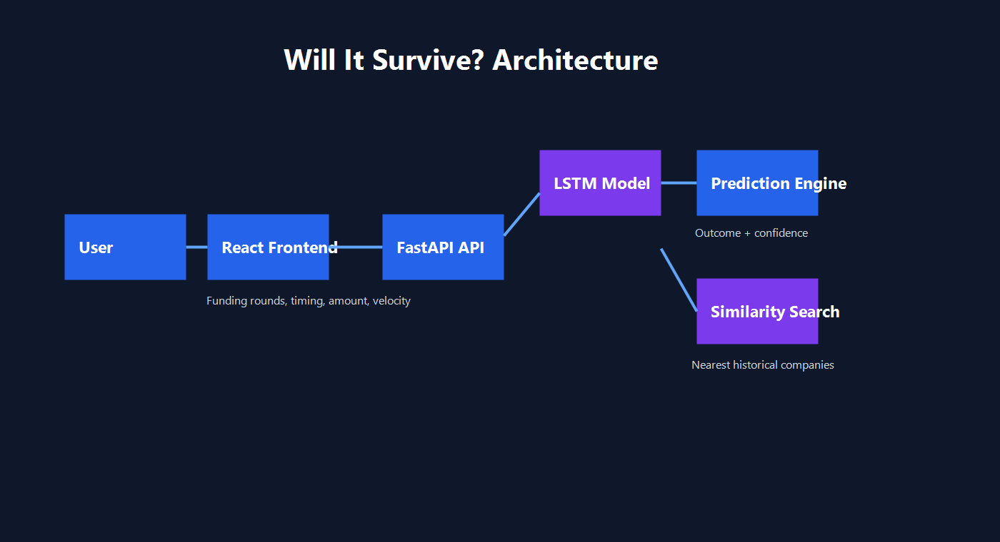
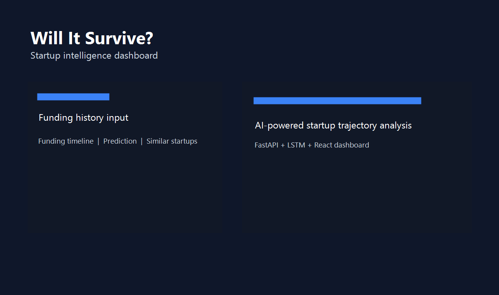
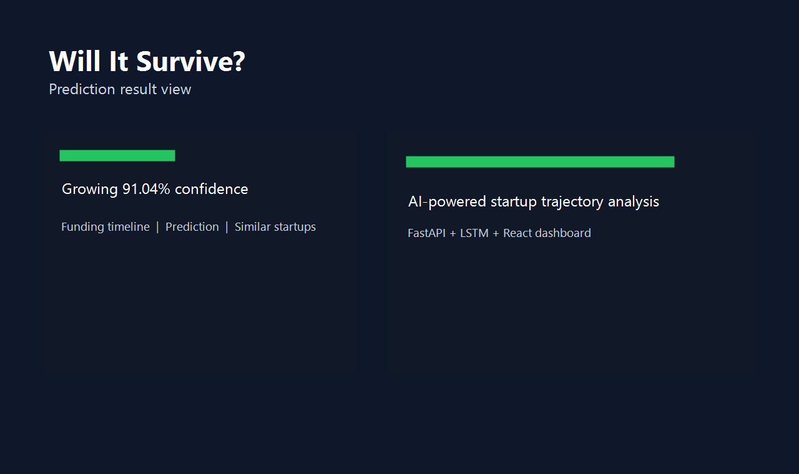
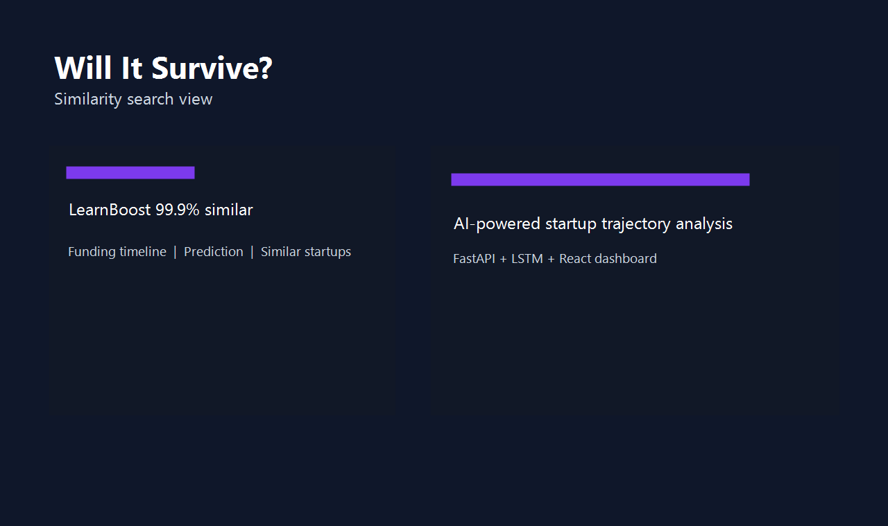
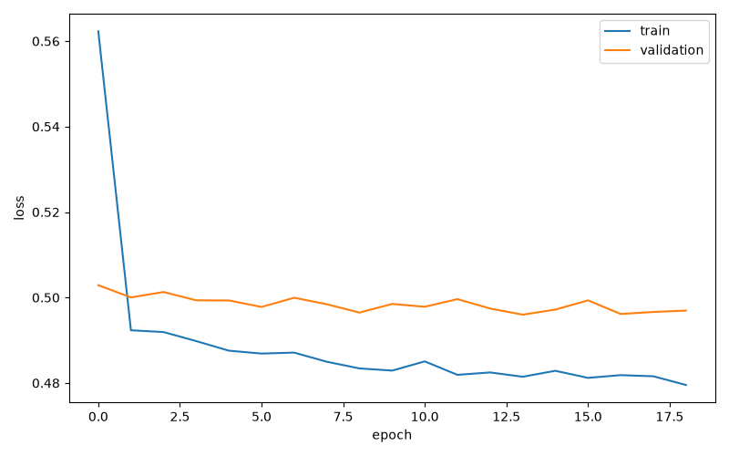
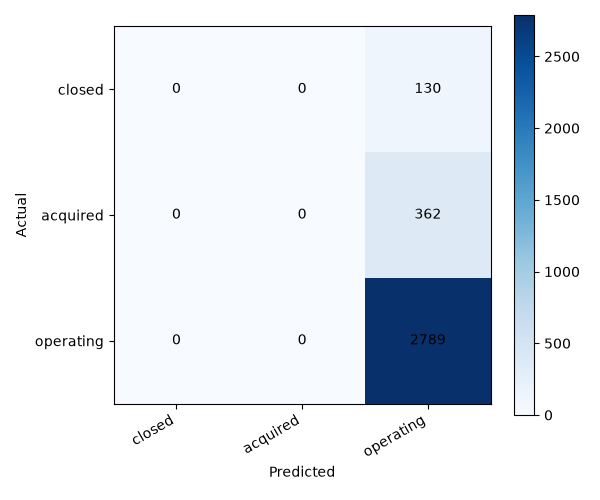

# Will It Survive?

AI-powered startup trajectory analysis platform.

Will It Survive? predicts whether a startup is trending toward shutdown, acquisition, or continued growth using historical funding sequences and LSTM-based time-series modeling.

## Features

- Funding timeline analysis
- LSTM sequence modeling
- Startup outcome prediction
- Confidence scoring
- Similar startup discovery with learned embeddings
- Interactive funding charts
- FastAPI backend
- React dashboard

## Tech Stack

Frontend: React, TailwindCSS, Framer Motion, Recharts, Axios

Backend: FastAPI, TensorFlow, Scikit-Learn, Pandas, NumPy

ML: LSTM sequence model, StandardScaler preprocessing, nearest-neighbor retrieval with cosine similarity

Deployment targets: Render for API, Vercel for frontend

## Architecture



```text
User
  -> React Frontend
  -> FastAPI API
  -> LSTM Model
  -> Prediction Engine
  -> Similarity Search
```

## Model Pipeline

```text
Funding Events
  -> Feature Engineering
  -> Time-Series Sequences
  -> LSTM
  -> Embedding Layer
  -> Outcome Prediction
  -> Nearest Neighbor Search
```

Engineered features include log funding amount, days since previous round, funding growth rate, cumulative funding, funding velocity, startup age, round number, and encoded round type.

## Results

| Model | Accuracy | Macro F1 |
| --- | ---: | ---: |
| Logistic Regression | 0.3310 | 0.2658 |
| LSTM | 0.8500 | 0.3063 |

The dataset is heavily imbalanced toward operating companies, so macro F1 is the more honest metric. The current LSTM provides a strong full-stack ML demo, and the next modeling improvement should focus on class imbalance with class weights, resampling, or threshold tuning.

## Screenshots











## Local Setup

Install backend dependencies:

```powershell
python -m pip install -r requirements.txt
```

Run the backend:

```powershell
cd backend
python -m uvicorn app:app --reload
```

Open the API docs:

```text
http://127.0.0.1:8000/docs
```

Run the frontend:

```powershell
cd frontend
npm install
npm run dev
```

Create a frontend env file for local development:

```text
VITE_API_URL=http://localhost:8000
```

## Example API Request

```json
{
  "rounds": [
    {
      "amount": 500000,
      "days_since_last_round": 0,
      "round_number": 1,
      "round_type": 0
    },
    {
      "amount": 2000000,
      "days_since_last_round": 180,
      "round_number": 2,
      "round_type": 1
    }
  ]
}
```

Example response:

```json
{
  "prediction": "Growing",
  "confidence": 91.04,
  "similar_startups": [
    {
      "name": "LearnBoost",
      "similarity": 99.9
    }
  ]
}
```

## Deployment

### Backend on Render

Create a Render Web Service connected to the GitHub repo.

Recommended settings:

```text
Runtime: Python
Root Directory: backend
Build Command: pip install -r requirements.txt
Start Command: uvicorn app:app --host 0.0.0.0 --port $PORT
Environment: PYTHON_VERSION=3.11
```

After deploy, test:

```text
https://your-api.onrender.com/docs
```

### Frontend on Vercel

Import the repository into Vercel.

Recommended settings:

```text
Framework: Vite
Root Directory: frontend
Build Command: npm run build
Output Directory: dist
```

Set this environment variable:

```text
VITE_API_URL=https://your-api.onrender.com
```

## Production Test Scenarios

Scenario 1:

Seed 500k, Series A 2M, Series B 10M. Expected direction: Growing.

Scenario 2:

Seed 300k, long gap, small follow-up round. Expected direction: shutdown risk.

Scenario 3:

Use a sample startup from the dropdown. Expected output: prediction, confidence, and similar startups.

## Resume Bullets

- Built an AI-powered startup survival prediction platform using LSTM-based time-series modeling on historical funding trajectories.
- Engineered funding velocity, growth rate, cumulative funding, and round timing features from Crunchbase startup datasets.
- Developed a similarity search engine using learned startup embeddings and nearest-neighbor retrieval to identify comparable historical companies.
- Packaged a full-stack ML application using React, FastAPI, TensorFlow, Recharts, and deployment-ready Render/Vercel configuration.

## Portfolio Description

Will It Survive? is an AI-powered startup intelligence platform that analyzes funding histories and predicts whether a startup is likely to shut down, be acquired, or continue growing. The system uses LSTM-based sequence modeling, engineered funding trajectory features, and startup embedding similarity search to identify historical companies with comparable growth patterns. Built with React, FastAPI, TensorFlow, and Recharts.
